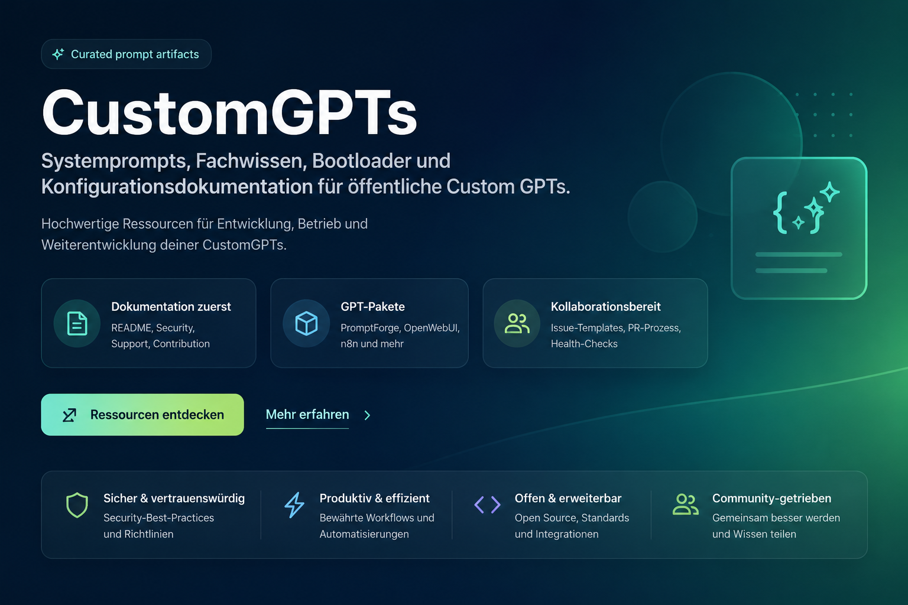

# CustomGPTs

Languages: [Deutsch](README.md) | [English](README.en.md)

> **Maintenance status since 24 May 2026:** This repository is a completed public reference and template collection. It is not actively developed. The contents remain usable, but issues and pull requests are handled without a guaranteed response.



[](https://github.com/adrianweidig/custom-gpts/actions/workflows/repository-health.yml)
[](LICENSE)
[](https://github.com/adrianweidig/custom-gpts/issues)
[](https://github.com/adrianweidig/custom-gpts/pulls)

Curated repository for public Custom GPT configurations, system prompts, knowledge files, bootloaders, icons and supporting documentation.

This project is not an installable software package and not a central application. It is a traceable collection of GPT artifacts that can be used directly in ChatGPT or reviewed, adapted and maintained locally.

## Quick Links

- [Public ChatGPT links](#public-chatgpt-links)
- [Repository structure](#repository-structure)
- [Local use](#local-use)
- [Internationalization](#internationalization)
- [Quality checks](#quality-checks)
- [Contributing](CONTRIBUTING.en.md)
- [Security Policy](SECURITY.en.md)
- [Support](SUPPORT.en.md)
- [Changelog](CHANGELOG.en.md)
- [German README](README.md)

## Who This Repository Is For

- People who want to understand or extend robust Custom GPT configurations.
- Teams that want to version prompt, knowledge and bootloader artifacts cleanly.
- Users who want to use the public GPTs directly through ChatGPT.
- Maintainers who want to review, keep consistent or collaboratively improve individual GPT packages.

## What Is Included

| Area | Purpose |
|---|---|
| Prompt and system files | Role logic, limits, response quality and control behavior of the GPTs |
| Knowledge files | Domain rules, quality criteria and structural knowledge |
| Bootloaders | Compact instruction text for GPT configuration |
| GPT metadata | Positioning, target groups, conversation starters and use cases |
| Icons | Symbol graphics for individual GPTs, where available |
| Problem briefings | Offline-oriented briefings for common OpenWebUI model tasks |
| Example artifacts | Sample answers or complete sample files such as `beispiel.md`, `beispiel.py` or `beispiel_test.py` |

## Public ChatGPT Links

| GPT | ChatGPT link | Local folder |
|---|---|---|
| PromptForge | https://chatgpt.com/g/g-6a0ac654618c81919f30c2da2be089c8-promptforge | [`Promptgenerator`](Promptgenerator/README.en.md) |
| Unterrichtsfolien & Handout Builder | https://chatgpt.com/g/g-6a071be465ac8191b27a4b5fb5789b0a-unterrichtsfolien-handout-builder | [`Unterrichtsfolien & Handout Builder`](Unterrichtsfolien%20%26%20Handout%20Builder/README.en.md) |
| OpenWebUI Model Builder | https://chatgpt.com/g/g-6a070eda8fdc81918ab61d4c4f1aa136-openwebui-model-builder | [`OpenWebUI Model Builder`](OpenWebUI%20Model%20Builder/README.en.md) |
| n8n Workflow Architect | https://chatgpt.com/g/g-6a06f5d8d0ac81918ce368d8db8a9bf5-n8n-workflow-architect | [`N8N-Generator`](N8N-Generator/README.en.md) |
| CustomGPT Studio | https://chatgpt.com/g/g-6a06ef9be6fc819197d7b815debd0f57-customgpt-studio | [`Custom-GPT-Generator`](Custom-GPT-Generator/README.en.md) |
| KI-Integration Sicherheitsberater | https://chatgpt.com/g/g-6a06d83ba4808191bffb12f7aa4b043b-ki-integration-sicherheitsberater | [`KI-Integration Sicherheitsberater`](KI-Integration%20Sicherheitsberater/README.en.md) |
| Präsentationscreator | https://chatgpt.com/g/g-69fdf8ef05c08191bb3a5454c597baa7-prasentationscreator | [`Präsentationscreator`](Präsentationscreator/README.en.md) |

## Additional Prepared GPT Packages

These packages are complete locally but do not yet have a public ChatGPT link.

| GPT package | Focus | Local folder |
|---|---|---|
| Code Review Coach | Code review, refactoring, security and test gap analysis | [`Code-Review Refactoring Coach`](Code-Review%20Refactoring%20Coach/README.en.md) |
| TestCase Studio | Test case derivation from requirements, user stories and bug reports | [`Testfall-Generator`](Testfall-Generator/README.en.md) |
| Research Briefing Builder | Research briefings, source comparison and uncertainty marking | [`Research Briefing Builder`](Research%20Briefing%20Builder/README.en.md) |
| Decision Memo Builder | Decision memos, option comparisons and management notes | [`Entscheidungsvorlagen Builder`](Entscheidungsvorlagen%20Builder/README.en.md) |

## Repository Structure

| Path | Contents |
|---|---|
| [`Code-Review Refactoring Coach/`](Code-Review%20Refactoring%20Coach/README.en.md) | GPT package for code review, refactoring and tests, including sample code |
| [`Custom-GPT-Generator/`](Custom-GPT-Generator/README.en.md) | Artifacts for `CustomGPT Studio`, a GPT for designing complete Custom GPT packages |
| [`Entscheidungsvorlagen Builder/`](Entscheidungsvorlagen%20Builder/README.en.md) | GPT package for decision memos, option comparisons and management notes |
| [`KI-Integration Sicherheitsberater/`](KI-Integration%20Sicherheitsberater/README.en.md) | Security and governance GPT for AI adoption, automation and operating models |
| [`N8N-Generator/`](N8N-Generator/README.en.md) | GPT for importable n8n workflow JSONs with security assumptions and test notes |
| [`OpenWebUI Model Builder/`](OpenWebUI%20Model%20Builder/README.en.md) | GPT for OpenWebUI task models, model packages and knowledge files |
| [`OpenWebUI Model Builder/Problemfälle/`](OpenWebUI%20Model%20Builder/Problemf%C3%A4lle/README.en.md) | Curated briefings for common OpenWebUI use cases |
| [`Promptgenerator/`](Promptgenerator/README.en.md) | Artifacts for `PromptForge`, a GPT for robust prompt templates |
| [`Präsentationscreator/`](Präsentationscreator/README.en.md) | GPT for browser-based, presentation-ready web presentations |
| [`Research Briefing Builder/`](Research%20Briefing%20Builder/README.en.md) | GPT package for research briefings and source evaluation |
| [`Testfall-Generator/`](Testfall-Generator/README.en.md) | GPT package for test design and QA preparation |
| [`Unterrichtsfolien & Handout Builder/`](Unterrichtsfolien%20%26%20Handout%20Builder/README.en.md) | GPT for lesson slides and printable handouts |

## Local Use

No installation is required for most contents.

1. Clone or open the repository locally.
2. Choose a GPT folder from the overview.
3. Read the folder's `README.md` or `README.en.md` first.
4. Then review `customgpt_infos.md`, `systemprompt.md`, `fachwissen.md`, `bootloader.md` and any `beispiel.*` files together.
5. For direct live use, open the matching ChatGPT link from the table.

The individual artifacts have different roles:

| File | Function |
|---|---|
| `customgpt_infos.md` | Name, positioning, target group, use cases and configuration notes |
| `systemprompt.md` | Main logic for role, behavior, limits and output quality |
| `fachwissen.md` | Domain rules and structural knowledge |
| `bootloader.md` | Compact instruction text for GPT Instructions |
| `beispiel.md` or `beispiel.*` | Sample answer, sample file or multiple example artifacts for expected output quality |
| `icon.png` | Icon graphic, where available in the respective folder |

## Internationalization

German is the default language of this repository. GitHub does not automatically switch the normal repository view based on a visitor's language, so language versions are organized explicitly through files and links.

- [`README.md`](README.md) is the German landing page.
- [`README.en.md`](README.en.md) is the English landing page.
- [`docs/de/`](docs/de/index.md) contains the German documentation route.
- [`docs/en/`](docs/en/index.md) contains the English documentation route.
- English package overviews are stored as `README.en.md` next to the German package READMEs where the folder is relevant for international users.
- German remains the stable fallback when no language is reliably available or requested.
- UTF-8 is mandatory. Umlauts, accents, non-Latin scripts, emojis and bidirectional text must not be replaced with ASCII-only spellings.

The GPT artifacts themselves remain domain source artifacts. Many GPTs respond in the user's language; technical IDs, filenames, model parameters and import formats are not translated.

## Quality Boundaries

- Production secrets, tokens, credentials, personal data and confidential customer data do not belong in this repository.
- GPT artifacts must be reviewed by domain experts before production use, especially for education, security, automation, privacy and OpenWebUI model imports.
- Technical slugs, model IDs, filenames, URLs and parameters are not automatically translated.
- External media, fonts, scripts and published assets must be checked for license, privacy and availability before use.

## Development

There is no central development server, package manager or build process. Changes are usually Markdown, prompt or asset work.

Recommended workflow:

1. Run `git status --short --branch` before editing.
2. Change only the affected GPT subfolder.
3. Review all related files of a GPT together.
4. Maintain example artifacts as quality anchors: `beispiel.md` for sample answers and `beispiel.*` for concrete code or file results.
5. Do not add real credentials, API keys or customer data to examples.
6. Check local links, tables, headings and UTF-8 Unicode text.

## Quality Checks

Safe local checks:

```powershell
git status --short --branch
git diff --check
python scripts/validate_repository_i18n.py
```

The GitHub workflow [`Repository Health`](.github/workflows/repository-health.yml) validates required repository files, i18n structure, local Markdown links, referenced images, UTF-8 decoding and selected Unicode fixtures.

## Documentation

- [Contribution Guide](CONTRIBUTING.en.md)
- [Security Policy](SECURITY.en.md)
- [Support](SUPPORT.en.md)
- [Changelog](CHANGELOG.en.md)
- [German documentation](docs/de/index.md)
- [English documentation](docs/en/index.md)
- [FAQ](docs/en/FAQ.md)
- [Release process](docs/en/RELEASE_PROCESS.md)
- [Maintainer checklist](docs/en/MAINTAINER_CHECKLIST.md)
- [Internationalization](docs/en/I18N.md)
- [Codex Project Readiness](CODEX_PROJECT_READINESS.md)

## Contributing

This repository has not been actively developed since 24 May 2026. Contributions can still be submitted as notes, forks or pull requests, but review, merge and support are not guaranteed.

Suitable notes or contributions include:

- fixes for documentation, links, tables or terminology
- improvements to prompt consistency and structure
- well-founded additions to knowledge files
- new or improved problem briefings
- notes about unclear security, privacy or license boundaries

Details are in [`CONTRIBUTING.en.md`](CONTRIBUTING.en.md). Do not report security issues publicly as issues; follow [`SECURITY.en.md`](SECURITY.en.md).

## License

This repository is licensed under the [MIT License](LICENSE).

The license decision is not legal advice. For commercially important GPT packages, trademarks, training data, external sources or published assets, the license situation should be reviewed separately.

## Status

The repository is public, synchronized with GitHub and usable as a curated artifact collection. Since 24 May 2026 it is a reference state without active development. The current technical readiness state is documented in [`CODEX_PROJECT_READINESS.md`](CODEX_PROJECT_READINESS.md).
